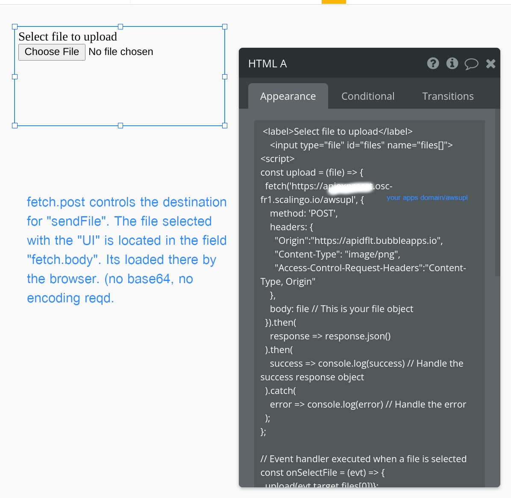
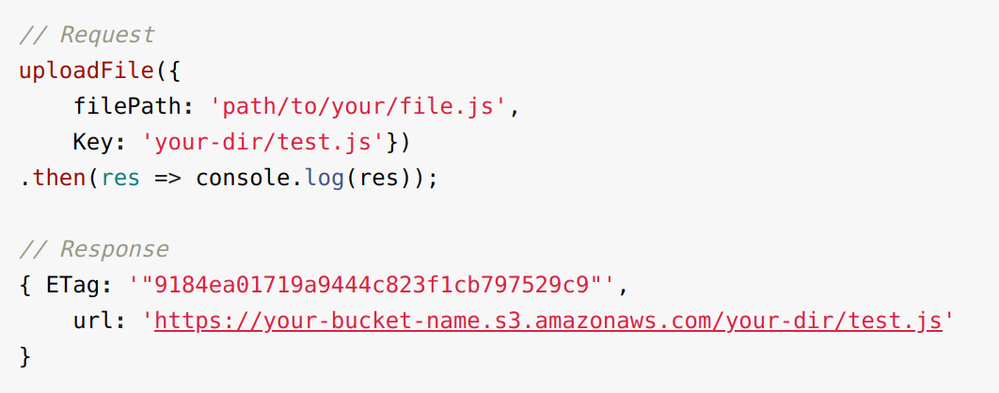
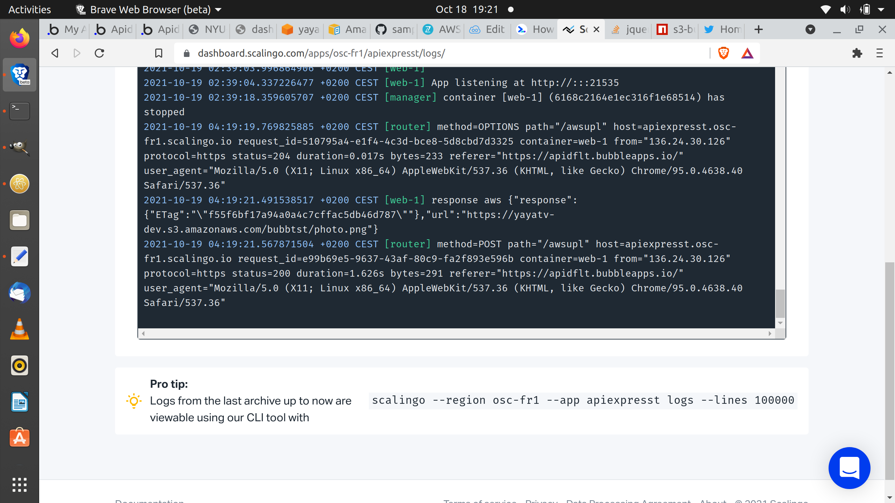
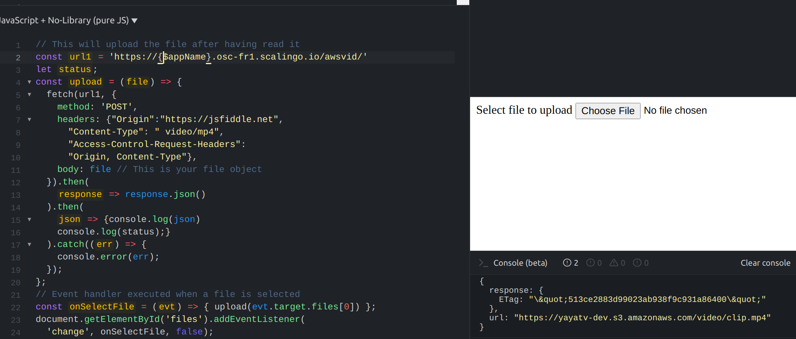
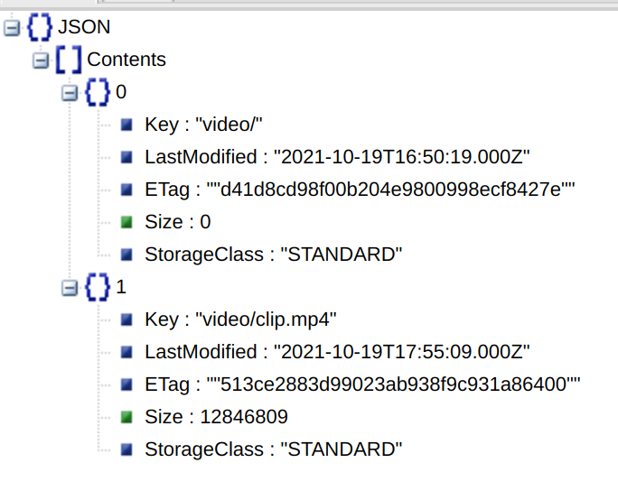
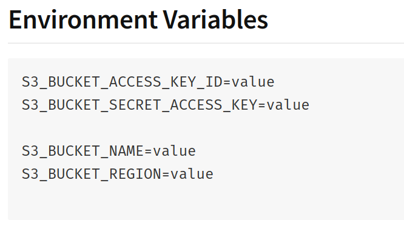

## Bubble utility - binary file mover ( node express server )
#### send binary files from / to
- move around binary files, with Endpoints or with API Connector using 2, encoded Urls  (from , to) as parameters. For, example to move/copy a jpeg from AWS S3 platform to another, 3rd party fileSys as a service, the Url for the Endpoint/ connector would be :

```
http://localhost:3000/files/https%3A%2F%2Fs3.amazonaws.com%2Fyayatv-dev%2F3c6429451c4c3af2d8e18085f957e612_image.jpeg/https%3A%2F%2Fs3.amazonaws.com%2Fyayatv-dev%2F3c6429451c4c3af2d8e18085f957e612_image.jpeg
```
and the node express route corresponding to the above client request is :

```
app.get('/files/:from/:to',  function(req, resp, next) {
  var url1, url2 = "";
```

Response is standard **http.response**

Full stdout log from curl client moving file from AWS to Parse-Server on [pastBin](https://pastebin.com/uG4p7Qij)

#### upload binary file to your AWS S3 bucket
 back-end (server-side) to UI dialog with file chooser. Uploads binary files to AWS S3 bucket ( config in ENV on the server). Bubble (UI-side) native html runs Fetch.Post in the browser. Native bytes in the file ( bypassing reqmt for base64 encode, bypassing Strings) are transferred using Node-Streams for best performance without cap limits on size.

 **Client dtls - native html w JS -> fetch.Post()**
 
 **Server - input = file. Send file via S3 API**
 Call API - S3.upload(file) push the file to the config'd bucket, sending response below.
 
 Client code JS function runs binary file upload and the handler on server uses **node streams** to pipe the file on to AWS API upload(file).

**Image Upload to AWS**
[Sample client side code](https://jsfiddle.net/rowntreerob/c94f5t3k/99/)
Endpoint used by the server is **/awsupl**
Client side code specifies mime type **photo/png**
Server logs show the json response as client would get it.


**Video Upload to AWS**

Endpoint used by the server is **/awsvid**
Client side code specifies mime type **video/mp4**
photo above (jsfiddle code ) shows json response in lower right hand side with the console output.
Listing of AWS bucket following 12 Meg video upload below-



Intended for devs with some node.express and some npm and some git background.

## Download, Install ##
using std. git.clone and node.npm.install

## dev run   localhost:3000 ##
```
cd $PROJECT_ROOT
node app    or  if .env used then run using belo
heroku local       // this pulls in .env values on localhost
```

use curl client , use Postman for client
remember to urlencode  each of the 2 url parms located in the full url's path.

## Config AWS S3, api specified Security (headers) ##
npm module **s3-bucket** connects to that service and needs values in following (env vars set on server):

in dev, per heroku implementation, manual edit on file=.env and then run on localhost w **heroku local** in term.

Use dashboard ( scalingo OR heroku ) for set Prod env var values.

# Sample Application with Node.js and Express Framework

This sample is running on: https://node-express.is-easy-on-scalingo.com/

## Deploy via Git

Create an application on https://scalingo.com, then:

```shell
scalingo --app my-app git-setup
git push scalingo master
```

And that's it!

## Deploy via One-Click

[](https://my.scalingo.com/deploy)

## Running Locally

```shell
docker-compose build
docker-compose run --rm web npm install
docker-compose up
```

## Links

Documentation: https://doc.scalingo.com/languages/javascript/nodejs
